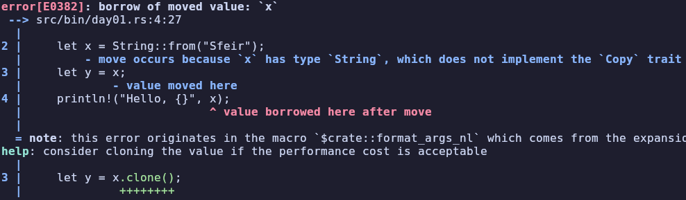

# Introduction à Rust


Note:
Bonjour...

---

## À propos


[https://github.com/KurzF/rust-reveal](https://github.com/KurzF/rust-reveal)

Note:
La présentation est disponible sur github, il y a le fichier markdown source et un export PDF
Si vous avez la moindre question durant ma présentation n'hésitez pas à m'interrompre de vive voix.

Chez Sfeir depuis février 2021
Dev fullstack Java - Spring / Angular

Mais aujourd'hui je viens vous parler en tant que dev Rust depuis 2022.
J'avais envie d'apprendre un nouveau langage pour découvrir un langage moderne.
Très rapidement mon choix se réduit à Go ou Rust, mais comme je veux aussi remplacer le C++ que je fais sur mon temps libre donc je choisis Rust.

(Si ça vous intérèsse je voulais remplacer le C++ à cause de l'absence de gestion de dépendances, des 4-5 constructeurs différents et des segfaults)

---

## Objectifs

- Pourquoi utiliser Rust ?
- Que ce qui rend Rust unique ?

Note:

L'objectif du talk n'est pas de vous apprendre à utiliser Rust

Le but est d'expliquer les différences entre Rust et les autres langages et les avantages que vous pouvez en tirer en tant que développeur.
Si cette présentation est réussie, vous pourrez déterminer vous même si Rust est un choix pertinent pour votre projet (pro ou perso) 

---

## Langage compilé

- Performant
- Unique à une platforme

Note:
Rust est un langage vraiment compilé et sans garbage collector (génère du code machine pas comme les tricheurs Java, C#).
L'avantage est la performance puisqu'on se passe d'une VM ou d'un interpréteur, en contrepartie on perd la portabilité cross platform offerte par les langages interprétés.

En pratique ce n'est pas vraiment un problème puisque tous les OS grand public sont supportés
[Liste complète](https://doc.rust-lang.org/nightly/rustc/platform-support.html)

La liste des platformes supportées contient des grands classiques comme le ARM64 macOS, x86_64 linux ou encore SPARC V9 Solaris ;p.
Dans les architectures plus rares on retrouve des architectures démodées, des microcontrôleurs (Comme ce petit microcontrolleur ARMv7 STM32f401 avec 96kO de ram et 512kO de stockage) et le web assembly

---

## Memory safety

- Assure la validité des opérations sur la mémoire
- Sans garbage collector

Note:

Un langage est dit "memory safe" s'il empêche les manipulations invalides de la mémoire (typiquement lire de la mémoire libérée/non-initialisée).

Si vous avez fait du C/C++ vous avez surement déjà vu un message "segfault: memory core dump": c'est l'OS qui tue votre programme parce que vous avez fait une opération mémoire invalide
Si vous êtes un dev Java/C#/Javascript/Go: félicitations ! Vous utilisez déjà un langage memory safe -> point commun: le GC

La particularité de Rust, c'est que le langage est memory safe sans GC

Les accès invalide à la memoire sont la source de nombreux problèmes:
- crash (segfault memory core dumped)
- bugs
- [failles de sécurité](https://cwe.mitre.org/data/definitions/1399.html)

Quelques failles de sécurité courante qui sont impossible dans les langages memory safe: use after free, buffer overflow, out of bounds access
[source](https://media.defense.gov/2023/Dec/06/2003352724/-1/-1/0/THE-CASE-FOR-MEMORY-SAFE-ROADMAPS-TLP-CLEAR.PDF)

---

## Hello, World!

Note:
Assez de théorie, je vous propose d'écrire ensemble le traditionnel Hello, World!
Et pour commencer nous allons créer notre projet avec cargo

---

## Cargo

- Gestion de dépendances
- Et bien plus

Note:
Cargo est le gestionnaire de dépendance mais ça va aussi être notre interface avec nos outils 
En plus de la gestion de dépendances il peut créer des projet (new), compiler et lancer notre exécutable (run) et les tests (test), générer la documentation (doc), formatter (fmt)

---

Créer une application
```bash
cargo new projet
```

---

```
project/
├── src
│   └── main.rs
└── Cargo.toml
```

Note:
Le dossier src/ contient le code Rust
Le fichier main.rs est particulier, c'est dans ce fichier que le compilateur va chercher le point d'entrée de notre application 

Enfin le fichier Cargo.toml contient la configuration de notre package

---

```rust[1,3|2]
fn main() {
    println!("Hello, world!");
}

```

Note:
Une fonction est déclaré par le mot-clé 'fn'
Le nom de la fonction est unique (impossible d'avoir plusieurs fonctions avec le même nom mais des paramètres différents)
Les arguments sont au format "nom: TYPE"
Si une valeur est retourné on l'indique après la flèche

Très simple: il n'y a pas d'argument par défaut/optionel/nommé, pas de varargs/variadic

La fonction main dans le fichier main.rs est le point d'entrée de notre application, comme vous pouvez le voir il ne prend aucun argument et ne retourne rien.

Notre main appelle une fonction qui va afficher "Hello, world!" dans la console

---

```rust[2]
fn main() {
    let name = "Sfeir";
    println!("Hello, {}!", name);
}

```

Note:
Une variable est déclaré avec le mot-clé "let" suivie de son nom, par défaut le type est inféré.
Attention les variables sont quand même strictement typées (ne peuvent pas changer de type) et en plus les variables ne sont pas nullable. 

---

```rust[3]
fn main() {
    let name  = "Sfeir";
    println!("Hello, {}!", name);
}
```

Note:
Si vous suivez attentivement vous devriez avoirs des questions sur `println!`:
- Pourquoi elle a un point d'exclamation ?
- Pourquoi elle peut prendre 1 ou 2 argument ?

Ce n'est pas vraiment une fonction: c'est une fonction-like macro
Les macros sont un mécanisme de métaprogrammation qui génère du code.

C'est hors sujet donc retenez juste que les macros peuvent ignorer des règles de syntaxe puisqu'une étape d'expansion va les réécrire  

---

```rust[2-3]
fn main() {
    let mut name = "World";
    name = "Sfeir";
    println!("Hello, {}!", name);
}

```

Note:
Une variable est immutable par défaut, il suffit de faire suivre un `mut` à `let` pour la rendre mutable

---

```rust[2]
fn main() {
    let name: &str = "Sfeir";
    println!("Hello, {}!", name);
}
```

Note:
Parfois vous devrez préciser le type manuellement si le compilateur n'arrive pas à le trouver lui même.

Le type de name est "&str" qu'on peut découper en deux parties "&" et "str". Le "&" signifie que notre variable est une référence et "str" est communément appelé "string slice".

---

## Références
- adresse vers une valeur
- toujours valide


Note:
Les références sont des adresses vers des valeurs.
En Rust les références sont explicites (comme en C++), signalées par "&"

On fait des références pour éviter de dupliquer nos valeurs, la plupart des langages avec GC font eux-même le choix de passer par référence ou de copier les valeurs

---

## Rappels sur la mémoire


Note:
Pour pouvoir être exécuté notre programme a besoin de mémoire (Du point de vue de l'application la mémoire est continue, c'est la mémoire virtuelle fournie par l'OS).

Chaque bloc décrit ici à un rôle précis:

---

## Blocs statiques

- Text contient les instructions
- Data contient les variables statiques initialisés
- Bss contient les variables statiques non initialisés

Note:
Les blocs text, data et bss sont de taille fixe et sont donc très simple à gérer.
Il faut juste initialiser les variables dans Bss avant d'y accéder

---

## Stack

```rust
let var1 = 58;
{
    let var2 = 39
} // var2 n'est plus accessible 
```


Note:
La stack est le bloc qui va contenir toutes nos variables, elle est gérée automatiquement par le compilateur.
Comme son nom l'indique c'est une pile où des valeurs sont insérées de manière continue, et son comportement est similaire à une LIFO

[Pour plus de détails](https://yuriygeorgiev.com/2024/02/19/x86-64-cpu-architecture-the-stack/)

---

## Heap

- Gestion manuelle
- Allocation lente


Note:
Le tas est le bloc le plus puissant. C'est lui qui va contenir nos données de taille dynamique ou trop grosse pour rentrer dans la stack.
En contrepartie la heap a 2 inconvénients:
Pour allouer de la mémoire, l'allocateur doit trouver un espace libre ou en redemander l'OS -> Ça prend un peu de temps et rend la heap plus lente que la stack lors de l'allocation.
Généralement le temps d'allocation reste très faible mais il faire beaucoup d'allocations/déallocations très rapidement peut ralentir considérablement le programme

Le plus gros inconvénient c'est qu'elle doit être gérée manuellement soit par le dev (C/C++ : malloc/free) soit par le GC durant l'exécution

La gestion manuelle de la mémoire est la source de nombreux bugs ou failles de sécurité (ex: 70% des CVE Chromium sont des erreurs de memory safety)
Le garbage collector est beaucoup plus fiable mais au prix d'un peu de performance

---

## Surprise!

```rust
fn main() {
    let name: &str = "Sfeir";
    println!("Hello, {}!", name);
}
```


Note:
J'espère que vous avez été attentif !
Dans quelle partie de la mémoire est située la variable "name" ? Stack
Dans quelle partie de la mémoire est située la valeur "Sfeir" ? .data (C'est une constante -> variable statique initialisé)

---

## Et la memory safety ?

- Ownership
- Borrow checker

Note:
C'est bien joli tout ça mais à la base on devait résoudre le problème de la mémoire safety !

La solution est en 2 parties:
- L'ownership pour l'allocation/déallocation de la mémoire
- Le borrow checker pour valider les références

Ces deux éléments sont assez uniques à Rust et sont souvent cités comme les principaux obstacles à l'apprentissage de Rust

---

## Ownership

- Chaque valeur a un seul propriétaire
- Si le owner est *out-of-scope* la valeur est **dropped**

Note:

Les mots sont abstraits mais globalement ici une valeur désigne une structure ou une énumération
Le propriétaire est une variable qui possède une structure (cad: ce n'est pas une référence).
Lorsque le propriétaire est hors de portée, la valeur est supprimé immédiatement, contrairement au langage avec GC.

---

```rust
{
    let s: &str = "Hello, world!";
} 
```

Note:
Lorsque s sort de la portée, l'ownership ne fait rien puisque s n'est *pas* un owner (c'est une référence)

---

```rust
{
    let s: String = String::from("Hello, world!");
} 
```

Note:
Ici on a remplacé &str par String: s est le owner de la String.
Maintenant lorsque s sort de la portée, l'ownership nous dit que la String possédé par S doit être drop

---

```rust
{
    let s1: String = String::from("Hello, world!");
    let s2 = s1;
} 
```

Note:
Que se passe t-il quand "s2 = s1" s'exécute ? 
Dans beaucoup de langages avec GC s2 est une référence à s1 mais en Rust les références sont explicites.

---

```rust
{
    let s1: String = String::from("Hello, world!");
    let s2 = s1;
} 
```


Note:
On pourrait cloner s1. C'est possible avec la fonction "clone()" mais ce n'est pas très performant: il faut refaire une allocation et copier toute la chaîne !

---

```rust
{
    let s1: String = String::from("Hello, world!");
    let s2 = s1;
}
```


Note:
On pourrait copier seulement les métadatas de s1 et partager le buffer ?
Non, on brise une règle de l'ownership: une valeur n'as qu'un propiétaire

---

```rust
{
    let s1: String = String::from("Hello, world!");
    let s2 = s1;
    drop(s1);
    println!("{}", s2);
}
```


Note:
Si s1 est drop, en tant que owner de la chaîne de charactère, il libère la mémoire
Mais maintenant s2 a un "dangling pointer": un pointer qui ne mêne à rien.
C'est extrèmement dangeureux car si on essaye de lire le contenu de s2 c'est un "use after free" et si s2 est drop la libération du pointer va provoquer un double free

---

## Move
```rust
{
    let s1: String = String::from("Hello, world!");
    let s2 = s1;
    drop(s1);
    println!("{}", s2);
}
```


Note:
"s2 = s1" est un move ! On déplace la propriété de s1 vers s2 et s1 devient invalide. Plus de problèmes de mémoire

---

## Surprise 2

```rust
let x = String::from("Sfeir");
let y = x;

println!("Hello, {}", x);
```

Note:
Que va afficher le programme ? Une erreur "x" n'est plus valide à cause du move "y = x"

---

```rust
let x = String::from("Sfeir");
let y = x;

println!("Hello, {}", x);
```


Note:
Je vous invite à admirer la beauté du message d'erreur du compilateur
Il nous explique parfaitement la cause du problème

La valeur "Sfeir" a été déplacée vers de 'x' vers 'y'. Comme une valeur ne peut avoir qu'un propriétaire 'x' n'est plus une variable valide.
Le compilateur propose une solution: utiliser la méthode `clone()` qui va dupliquer la chaîne de caractères. Après la duplication 'x' garde sa chaîne de caractères et 'y' obtient une chaîne identique à celle de 'x'
Comme le compilateur le dit juste au dessus cloner a un coût: vous faîtes une nouvelle allocation mémoire qui peut prendre du temps et de la mémoire en fonction de la taille de la valeur dupliquée.

Vous avez peut-être remarqué que le compilateur nous dit aussi que le move a lieu parce que le type n'implémente pas le trait `Copy`.
Pour les types très petits le coût d'un clone est minuscule, le trait `Copy` est un marqueur qui indique au compilateur qu'il peut cloner tout le temps, ce qui permet de ne pas avoir à se soucier des moves.

---

## Borrow

```rust
let x = String::from("Sfeir");
let y = &x;

println!("Hello, {}", x);
```

Note:
Une solution que le compilateur n'a pas proposé est de faire un *emprunt* (on prend la valeur par référence)
Comme le nom l'indique plus que de prendre possession de la valeur, on va temporairement l'emprunter.
Ici, `x` est l'*owner* et `y` *borrow* la valeur de `x`. Comme `y` est une référence (et donc pas propriétaire), `x` est toujours valide !

---

## Dangling ?
```rust
let x = String::from("Sfeir");
let y = &x;
drop(x);

println!("Hello, {}", y);
```

Note:
On ne brise aucune règle de l'ownership et pourtant y est une référence invalide !
Et oui l'ownership sert à vérifier que la mémoire est déalloué seulement une fois ne garentit pas la validité des reférences.

---

## Borrow checker

```rust
let x = String::from("Sfeir");
let y = &x;
drop(x);

println!("Hello, {}", y);
```


Note:
Heureusement Rust à le **borrow checker** !

---

## Borrow checker

- Une référence est toujours valide
- Une valeur a une seule référence mutable **ou** plusieurs références immutables

Note:
La première règle est nécéssaire pour obtenir la *memory safety*: il ne faut pas que la valeur soit *dropped* pendant la *durée de vie* de la référence,
sinon on s'expose a des bugs comme le use after free qui au mieux provoque des segfault, au pire des undefined behavior et des failles de sécurités

La deuxième règle évite les *data race* et elle facilite grandement la *thread safety*.

---

## Surprise 3

```rust
let s1 = String::from("Sfeir");
let s2 = &s1;
let s3 = &s1;
```

Note:
Est-ce que ce code respecte le borrow checker ? Oui -> plusieurs références immutables

---

## Surprise 3

```rust
let mut s1 = String::from("Sfeir");
let s2 = &mut s1;
```

Note:
Est-ce que ce code respecte le borrow checker ? Oui mais il y a une erreur -> Il ne peut pas y avoir de référence mutable vers une valeur immutables
Contrairement à d'autre langages (Java, Typescript), une variable immutable est (par défaut) vraiment immutable. Il n'est pas possible de push() une valeur sur une liste immutable par exemple

---

## Surprise 3

```rust
let mut s1 = String::from("Sfeir");
{
    let s2 = &mut s1;
}
let s3 = &mut s1;
```

Note:
Est-ce que ce code respecte le borrow checker ? Oui -> La référence `s2` est relachée avant que `s3` ne soit déclaré !

---

## Félicitations

Note:
Bon, c'était compliqué tout ça ! Si vous n'avez pas tous saisi, c'est normal je suis allé très vite! Il m'a fallu plusieurs jours pour vraiment comprendre et connaître ces règles
Ce sont les 2 concepts qui différencient vraiment Rust des autres langages, le reste de la présentation sera beaucoup plus simple, promis !

---

## Struct

```rust
struct Person {
    name: String,
    role: Role
}
```

Note: 
Les structs sont l'équivalent des classes, elles rassemblent des données dans un type et permettent d'y associer des fonctionnalités 

---

```rust[2|3]
struct Person {
    pub name: String,
    pub(crate) role: Role,
}
```

Note:
Comme dans beaucoup d'autre langages un mécanisme d'encapsulation existe
Par défaut les champs d'une structure sont privés (accessible uniquement depuis le module actuel)
Avec `pub` on peut rendre un champ public dans n'importe quel module
Avec `pub(crate)` on rend le champ accessible dans la crate actuelle

---

```rust
let speaker = Person {
    name: String::from("Fabien"),
    role: Role::DevFullstack,
};
```

Note:
Pour instancier une structure, on donne le type suivi de toutes les clé-valeurs `champ: value`.
la syntaxe permet d'éviter les constructeurs avec beaucoup d'arguments et les objets à moitié initialisé
Si vous n'avez pas accès à un champ d'une structure il faudra utiliser **un constructeur**

---

```rust
impl Person
    pub fn manager() -> Person {
        Self {
            name: String::from("Joshua Liaud"),
            role: Role::DevFront, //Angular
        }
    }
}
```

```rust
let em = Person::manager();
```
Note:
Il n'y a pas de constructeur en Rust, mais il y a des fonctions associées (fonction statique en Java) qui peuvent retourner des instances
Les fonctions associées et les méthodes se déclarent dans un bloc d'implémentation séparé de la déclaration de la structure (mais dans la même crate)

---

```rust
impl Person {
    fn welcome(&self) {
        println!(
            "Bonjour, je m'appelle {} et je suis {}",
            self.name, self.role
        );
    }
}
```

Note:
Pour faire des méthodes, il suffit de créer une fonction associée avec en premier argument `self`, `&self` ou `&mut self`
Ces trois arguments permettent de faire la distinction entre passer par valeur, passer par référence et passer par référence mutable

Pour rappel le passage par valeur provoque un move à cause de l'ownership !

---

## Enumération

```rust
enum Role {
    DevFront,
    DevBack,
    DevFullstack,
    DevOps,
}
```

Note:
Les énumérations en Rust fonctionne comme celles de la plupart des langages 

---

## Enumération

```rust
enum Role {
    DevFront(TechFront),
    DevBack(TechBack),
    DevFullstack {
        front: TechFront,
        back: TechBack
    },
    DevOps,
}
```

Note:
Mais elles peuvent aussi avoir des données associées ! Les données peuvent être hétérogènes entre les variantes de l'enum sans aucun soucis
Les données associées peuvent être sous la forme d'un tuple, ou d'une structure

---

```rust
Person {
    name: String::from("Joshua Liaud"),
    role: Role::DevFront(TechFront::Angular),
}
```

---

```rust
impl Role {
    fn fullstack_java() -> Self {
        Self::DevFullstack {
            front: TechFront::GWT,
            back: TechBack::Java
        }
    }
}
```

Note:
Les enumérations peuvent définir des fonctions associées et des méthodes de la même manière que les structs

---

## Pattern matching

```rust
fn use_java(&self) -> bool {
    match self {
        DevFront(front) => front == TechFront::GWT,
        DevBack(back) => back == TechBack::Java,
        DevFullstack { front, back } => {
            front == TechFront::GWT || back == TechBack::Java,
        },
        _ => false
    }
}
```

Note:
Rust supporte le pattern matching qui permet de destructurer rapidement des valeurs. C'est particulièrement utilisé avec `match` l'équivalent d'un switch.
un `match` doit être exhaustif et c'est une expression (on peut assigner sa valeur à une variable)

---

## Traits

Note:
A peu près équivalent aux interfaces, les traits permettent de déclarer des comportements communs à plusieurs types.

Les traits sont utilisés pour beaucoup de choses:
- Ownership: Clone, Drop, Copy
- Opérateur: Add, Sub, Mul, Div, BitAnd, BitOr, BitXor, Shr, Shl, Neg, Not et leurs équivalents Assign
- Comparaison: PartialEq, Eq, PartialOrd, Ord
- Conversion: From, Into, TryFrom, TryInto
- Affichage: Debug, Display, ToString
- Itérateur

---

```rust[2|4-6]
pub trait Clone: Sized {
    fn clone(&self) -> Self;

    fn clone_from(&mut self, source: &Self) {
        *self = source.clone()
    }
}
```

Note:
La fonction clone n'a pas d'implémentation par défaut, elle doit être implémentée
La fonction clone_from a une implémentation par défaut et peut optionelement être override

---

```rust
impl Clone for Person {
    fn clone(&self) -> Self {
        Self {
            name: self.name.clone(),
            role: self.role.clone()
        }
    }
}
```

Note:
Un trait est implémenté de manière très similaire à une structure.
Comme les fonctions associées, l'implémentation d'un trait par une structure est séparée de la déclaration du type.

---

```rust
#[derive(Debug, Clone)]
pub struct Person {
    name: String,
    role: Role
}
```

Note:
Certains trait comme Clone, Debug, sont extrêmement courant et répétitif à implémenter. Et la solution à ce problème, c'est les derive macros.
Une derive macro permet d'implémenter un trait de manière simple et rapide.

---

## Générique

Note:
Rust à des génériques (fonction et type) qui permettent, associés au trait, de créer des API très flexibles

---

## Option

```rust
pub enum Option<T> {
    None,
    Some(T),
}
```

```rust
match opt {
    None => println!()
    Some(v) => println!()
}
```
Note:
Je vous présente les options. C'est ce qui remplace les nulls (l'avantage c'est que si une valeur peut être absente c'est visible dans le type)
Pour pouvoir utiliser la valeur contenue vous devez gérer le cas `None`

---

## Result

```rust
pub enum Result<T, E> {
    Ok(T),
    Err(E),
}
```

```rust
match res {
    Ok(v) => println!("Tout va bien: {}", v),
    Err(e) => println!("Erreur: {}", e),
}
```

Note:
Et les résultats utilisent aussi des enums générique pour représenter si une erreur a eu lieu.
Rust n'a pas d'exception, une erreur doit être encapsulé dans un `result` -> Toutes les erreurs possibles sont visible dans la signature d'une fonction

---

## Tests unitaires

```rust[1,3|2]
#[cfg(test)]
mod tests {
    
    #[test]
    fn add() {
        assert_eq!(1 + 2, 3);
    }
}
```

Note:
Les tests unitaires sont généralement écrire dant le même fichier que le code à tester.
La macro `cfg(test)` permet de compiler les tests uniquement pour leur exécution et chaque test doit être annoté avec la macro `test`

---

## Conclusion

Note:
Inconvénients:
Vous l'avez constaté par vous-même c'est un langage qui demande plus d'effort au dev -> Plus lent (A apprendre, comme à écrire)
Les temps de compilation: Le compilateur fait beaucoup de vérifications et il peut prendre beaucoup de temps (surtout si vous abusez des macros)

Avantages:
Performances: Pas forcément le plus pertinent dans une application mais ça peut répondre à un besoin particulier
Fiabilité: Pas de null, exceptions explicites, typage fort et expressif
Qualité des outils: Cargo est merveilleux, les messages du compilateurs sont clairs, Rustfmt a une excellente configuration par défaut, Rustdoc est très agréable, ajouter des tests unitaires est ridiculement simple

---

## Resources

- [The Rust book](https://doc.rust-lang.org/stable/book/)
- [The Rust book with quiz](https://rust-book.cs.brown.edu/)
- [Rustlings](https://rustlings.rust-lang.org/)
- [Rust by example](https://doc.rust-lang.org/stable/rust-by-example/)

---

## Des Questions ?

---

## Merci pour votre attention
